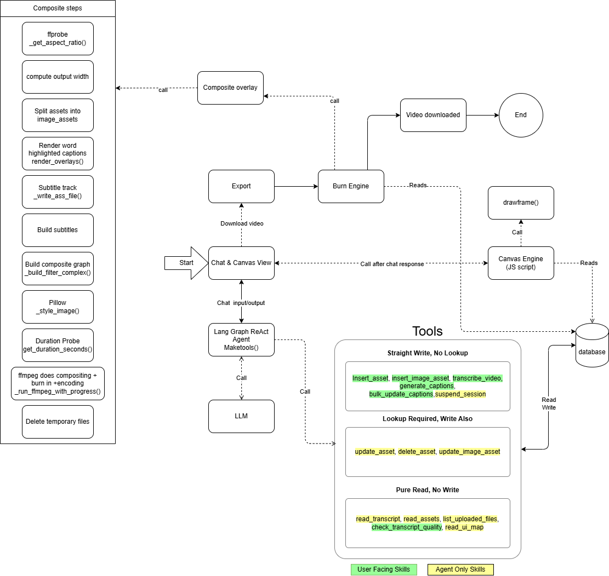

# Video Editing Agent

An AI driven video captioning pipeline, you upload a video and then talk to it, like "Make the captions bigger", "Change the color" or "increase the size of all the cloud words in the captions".

The interesting part isn't captions but the LLM, here LLM is holding control of an expensive, Stateful, side effecting pipeline. But it also has to stay cheap to scale and safe.

## The problem I designed against
An agent with video editing tools can cause three problems

1. Cost : Every render is FFMPEG caption burning on video which is very expensive to render in both cost and time and would be unusable at any price.
2. Correctness : Tools need to know what they are mutating any wrong mutation can corrupt the job.
3. Runway context : Chats compound the token expenditure as every new message is a token addition on top of all the previous messages.

## Architecture



## Agent 

the agent itself is a Langgraph ReAct loop over an open ai compatible chat model, the pipeline for edting consists of tools rather then any sequence which the agent can use as needed, no hardcoded flow


## Key decisions
#### Tools are classfied by write semantics

| Class | Why |
|---|---|
| Pure read, no write | These are safe to retry and safe to call, no guard required |
| Straight write, no look up | Create a new asset, no history present |
| Look up required, write also | Resolve the target against the existing db |

Here the third row is the most important, as i did remove an asset from the video but as the agent had context of the old asset it tried to manipulate that and kept giving errors. But with lookup required the agent reliably finishes its task and can see the changes aswell.

#### Agent operation layer
The agent reads and writes a structured transcript and style state, which is then rendered in browser with js. The agent never touches the video bytes, which makes the system extremely affordable.
1. Preview is browser side with js canvas engine
2. The real render only happens once the video is exported.

#### Session budget
Each session is capped at 150k tokens, with per message limit of up to 8000 characters. This makes the worst case cost of a session i can keep track of, instead of being surprised by a random bill.

#### Tiers
Guest / Free / Pro gate video  count, size and duration. Which is enforced at upload not at render.

#### Call logging
chat and chat session(chat/models.py) are not deleted by auto as the agents are non deterministic systems and can only be debugged by analysis

## Stack
Django, Langgraph / Langchain, Groq(whisper), LLM, ffmeg, Pillow, Postgresql.
#### Apps
1. Videos - upload, status views, and media serving
2. Chat - sessions, messages, agent definition and tool calling loop
3. pipeline - transcription, caption generation, overlays and tool calling by agent
4. user_accounts - users profile

## Setup

```bash
# Activate the virtualenv
source venv/Scripts/activate   # Git Bash / PowerShell on Windows

# Install dependencies
pip install -r requirements.txt

# Configure environment variables in a .env file at the project root:
#   GROQ_API_KEY=
#   DEEPSEEK_API_KEY=
#   DEEPSEEK_MODEL=
#   DEEPSEEK_TEMPERATURE=
#   DEEPSEEK_REASONING_EFFORT=

# Apply migrations
python manage.py migrate

# Run the dev server
python manage.py runserver
```
## Next
1. Tests for lookup 
2. Move rendering to a task queue
3. Structured evals for the agent